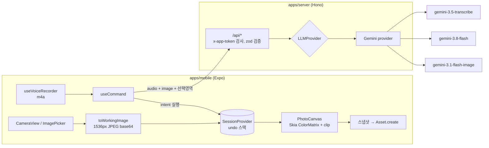
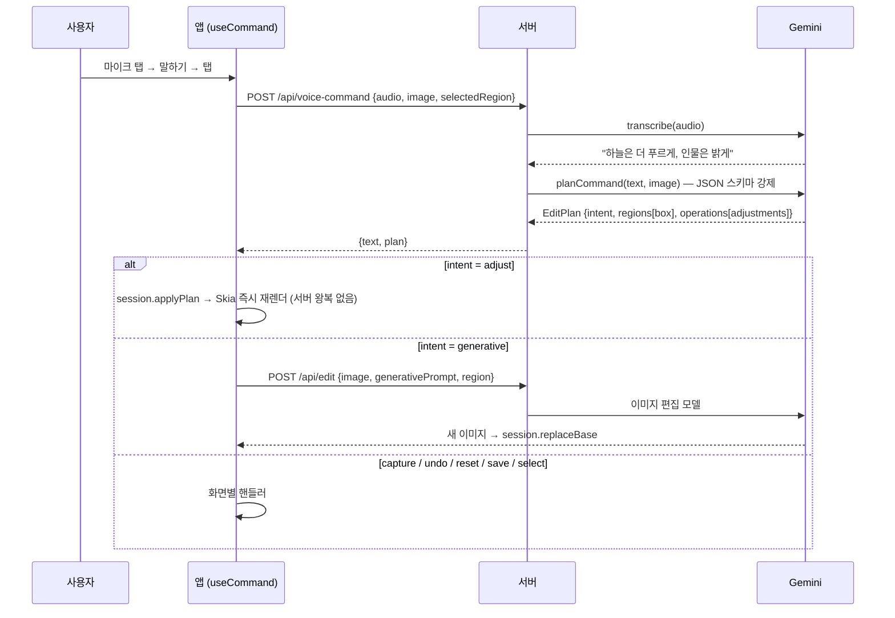

# 아키텍처

## 구성

```
side1/
├── apps/
│   ├── mobile/   Expo 앱 — 촬영, 녹음, 비파괴 보정 렌더링, 저장
│   └── server/   Hono API — LLM 프록시 (키 보관), 공급자 추상화
├── docs/         이 문서들
└── CLAUDE.md     개발 컨텍스트 진입점
```



## 핵심 흐름: 음성 명령



## 설계 원칙

1. **LLM은 "계획"만, 픽셀은 디바이스가.**
   대부분의 보정(밝게/따뜻하게/채도)은 LLM이 수치(`Adjustments`)만 결정하고, 앱이 Skia 컬러 매트릭스로 적용한다. 빠르고(추가 왕복 없음), 싸고, 원본을 훼손하지 않으며, 슬라이더로 미세조정하는 UI를 붙이기 쉽다.
2. **생성형 편집은 예외 경로.** 객체 제거·배경 교체·화풍 변경처럼 파라메트릭으로 불가능할 때만 `intent: generative` 로 이미지 모델을 호출한다. 결과는 새 `base` 가 되고 기존 파라메트릭 보정은 그 위에 유지된다.
3. **비파괴 + undo 스택.** `SessionProvider` 는 `EditState{base, global, regions}` 스냅샷 배열. 되돌리기 = pop. 저장 시점에만 픽셀을 확정한다.
4. **영역은 공통 좌표계 하나.** Gemini 네이티브 박스 포맷 `[ymin, xmin, ymax, xmax]`(0–1000)를 앱 전체에서 그대로 쓴다. AI 감지·손 드래그·음성 지정 모두 같은 `Region` 타입.
5. **공급자 교체 가능.** 라우트는 `getProvider()` 만 안다. `LLM_PROVIDER` 환경변수로 선택.
6. **스키마 단일 원본.** 서버 zod 스키마 → `z.toJSONSchema()` → Gemini `responseJsonSchema`. 같은 스키마로 응답을 다시 `parse` 해 형식을 보장.

## 명령 → 동작 매핑 (intent)

| intent | 예시 발화 | 앱 동작 |
|---|---|---|
| `capture` | "찍어줘" | 촬영 화면에서 셔터 실행 |
| `adjust` | "하늘 더 파랗게", "전체 조금 밝게" | 전역/영역 `Adjustments` 누적 |
| `select` | "왼쪽 나무만 선택해" | `session.selected` 설정 → 이후 명령의 기본 대상 |
| `generative` | "뒤에 지나가는 사람 지워줘" | `/api/edit` 호출 → base 교체 |
| `undo` / `reset` | "취소", "원래대로" | 스택 pop / 원본으로 |
| `save` | "저장해줘" | 비교·저장 화면으로 이동 |
| `unknown` | — | `reply` 로 되묻기 |

## 보안 경계

- Gemini 키: 서버 `.env` 에만 존재. 앱은 서버 URL과 `APP_TOKEN` 만 안다.
- `APP_TOKEN` 은 개발용 공유 비밀 — **번들에 포함되므로 실제 인증이 아님**. 배포 전 사용자 인증 + 레이트 리밋으로 대체해야 함 (ISSUES.md S-2).
